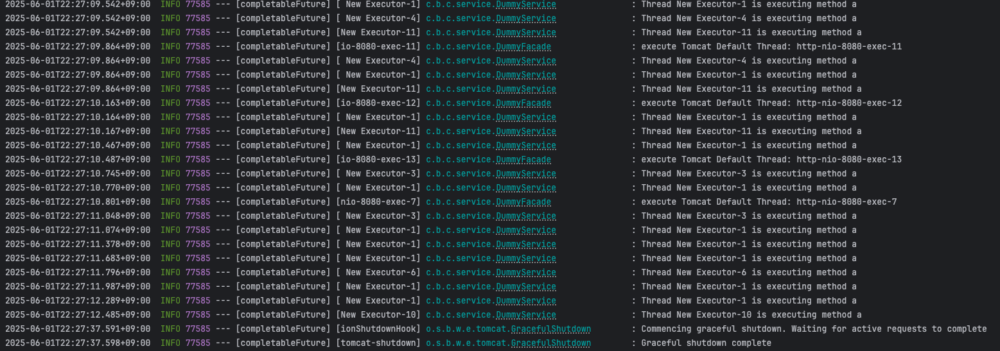

# Completable Future 질문 모음

### CompletableFuture 내부에서 하나의 작업에서 병목이 생길 때 allOf() 내부에서 이미 행위를 마친 다른 스레드가 사용 될 수 있는가?

- **테스트를 해보니 가능하다.** Mvc + WebFlux 기반의 프로젝트를 별도로 구성해야 하는가에 대한 주제로 나오게 된 질문.
- Mvc의 톰캣스레드는 결국 처음에 서블릿 컨테이너로 부터 하나의 스레드를 할당받고 WebFlux 기반은 Netty로 이벤트 루프 기반으로 동작하며 논블로킹으로 동작하는데, 결국 서블릿 컨테이너로부터 할당받은 스레드가 동기로 동작하니 결과적으로는 동기이다. 
- 결론적으로, Netty 기반의 WebFlux가 사용되는 서버가 아니면, 하나의 요청은 동기적으로 동작하는것이라 크게 의미가 없다고 생각했다.